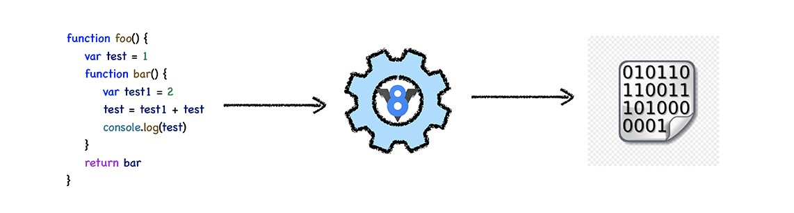
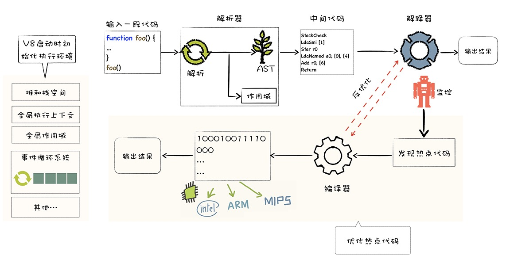

# google V8
---------------------------
- JavaScript 借鉴了很多语言的特性，比如 C 语言的基本语法、Java 的类型系统和内存管理、Scheme 的函数作为一等公民，还有 Self 基于原型（prototype）的继承机制；
- v8是js虚拟机的一种；SpiderMonkey、V8、JavaScriptCore都是js虚拟机；

- V8 率先引入了即时编译（JIT），混合编译执行和解释执行；
- V8 也是早于其他虚拟机引入了惰性编译、内联缓存、隐藏类等机制，进一步优化了 JavaScript 代码的编译执行效率。
- 了解v8有什么用？可以解决哪些问题？
  - 项目的占用内存过高，
  - 页面响应速度过慢，
  - 使用 Node.js 的时候导致任务被阻塞等问题；如果你熟悉 V8 的工作机制，就会有系统性的思路来解决这些问题
- V8 的编译流水线：


- 为什么解释执行就会导致语言执行速度过慢
  - 执行过程中要先编译源码，再执行，多了个编译阶段
  - 大部分解释性语言是动态语言，动态语言的数据类型是在运行时检查的，这又耗费了额外的时间
- v8是怎嘛样处理js的
  - 将js转换为字节码，然后有个解释器来执行字节码
  - 如果有一块字节码会被反复执行，那么V8会将字节码转换为二进制机器代码，然后cpu直接执行二进制的机器代码
-  V8 执行一段 JavaScript 代码所经历的主要流程
  - 初始化基础环境；
  - 解析源码生成 AST 和作用域；
  - 依据 AST 和作用域生成字节码；
  - 解释执行 字节码
  - 监听热点代码；
  - 优化热点代码为二进制的机器代码；
  - 反优化生成的二进制机器代码；
# 快属性和慢属性：V8是怎样提升对象属性访问速度的？
```

function Foo() {
    this[100] = 'test-100'
    this[1] = 'test-1'
    this["B"] = 'bar-B'
    this[50] = 'test-50'
    this[9] =  'test-9'
    this[8] = 'test-8'
    this[3] = 'test-3'
    this[5] = 'test-5'
    this["A"] = 'bar-A'
    this["C"] = 'bar-C'
}
var bar = new Foo()
for(key in bar){
    console.log(`index:${key}  value:${bar[key]}`)
}
结果：

index:1  value:test-1
index:3  value:test-3
index:5  value:test-5
index:8  value:test-8
index:9  value:test-9
index:50  value:test-50
index:100  value:test-100
index:B  value:bar-B
index:A  value:bar-A
index:C  value:bar-C
```
  - 常规属性 (properties) 和排序属性 (element)
    - 在这里我们把对象中的数字属性称为排序属性，在 V8 中被称为 elements，字符串属性就被称为常规属性，在 V8 中被称为 properties。
  - 快属性和慢属性
    - 通常，我们将保存在线性数据结构中的属性称之为“快属性”，
    - 如果一个对象的属性过多时，V8 就会采取另外一种存储策略，那就是“慢属性”策略，但慢属性的对象内部会有独立的非线性数据结构 (词典) 作为属性存储容器。
  - 不建议使用 delete 来删除属性，为什么？
    - 如果删除属性在线性结构中，删除后需要移动元素，开销较大，而且可能需要将慢属性重排到快属性。如果删除属性在properties对象中，查找开销较大。
# 两道题
```
var n = 1;
(function foo(){
    n = 100;
    console.log(n);
}())
console.log(n);
```

```
var n = 1;
function foo(){
    n = 100;
    console.log(n);
}
console.log(n);
foo()
```
# 原型链：V8是如何实现对象继承的？
## 原型链是沿着对象的原型一级一级来查找属性的;
- 继承就是一个对象可以访问另外一个对象中的属性和方法，在JavaScript 中，我们通过原型和原型链的方式来实现了继承特性。
```
var animal = {
    type: "Default",
    color: "Default",
    getInfo: function () {
        return `Type is: ${this.type}，color is ${this.color}.`
    }
}
var dog = {
    type: "Dog",
    color: "Black",
}
dog.__proto__ = animal
dog.getInfo()
// "Type is: Dog，color is Black."
```
- 不应该直接通过 _proto_ 来访问或者修改该属性
  - 性能问题;
  - 这是隐藏属性，并不是标准定义的;
```
var dog = new DogFactory('Dog','Black');
----------------------------------------
var dog = {}
dog.__proto__ = DogFactory.prototype
DogFactory.call(dog,'Dog','Black')
```
# 用域链：V8是如何查找变量的？
## 作用域链就是将一个个作用域串起来，实现变量查找的路径；
- 全局作用域是在 V8 启动过程中就创建了，且一直保存在内存中不会被销毁的，直至 V8 退出。 而函数作用域是在执行该函数时创建的，当函数执行结束之后，函数作用域就随之被销毁掉了。
- this 是看函数的调用位置，作用域是看函数的声明位置。除了箭头函数等那些特殊的情况；
# 类型转换：V8是怎么实现1+“2”的？
。
# 如何构建和使用V8的调试工具d8？
- 找到了编译好的d8工具：
- mac平台:
- https://storage.googleapis.com/chromium-v8/official/canary/v8-mac64-dbg-8.4.109.zip
win64平台:
https://storage.googleapis.com/chromium-v8/official/canary/v8-win64-dbg-8.4.109.zip


